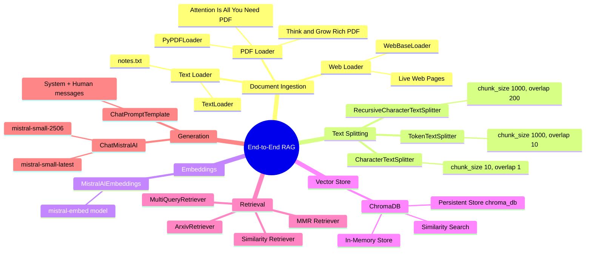
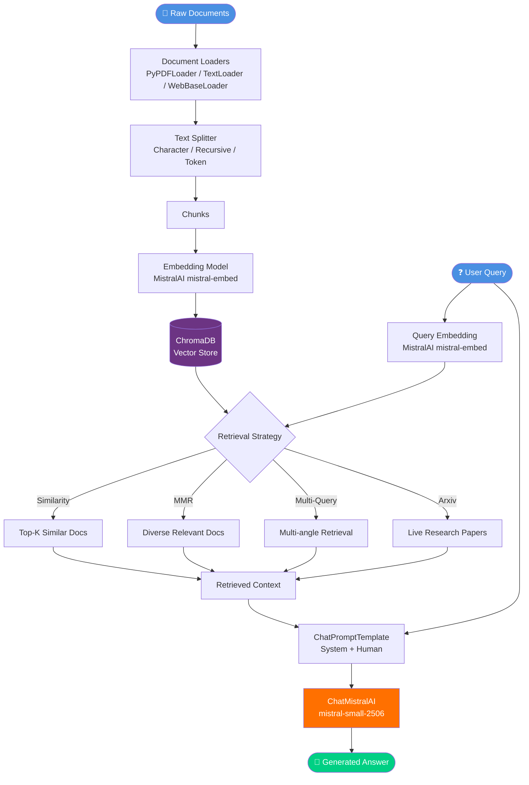

<div align="center">

# 🔍 End-to-End RAG Project

### *Retrieval-Augmented Generation — From Documents to Intelligent Answers*


<br/>

> **A hands-on, end-to-end Retrieval-Augmented Generation (RAG) pipeline built with LangChain, MistralAI, and ChromaDB. Covers every layer of the RAG stack — document ingestion, text splitting, embedding, vector storage, retrieval, and generation.**

[📖 Overview](#-overview) • [⚙️ Architecture](#️-architecture) • [📁 Repo Structure](#-repository-structure) • [🚀 Setup](#-setup--installation) • [▶️ How to Run](#️-how-to-run) • [🔑 Configuration](#-configuration) • [🧩 RAG Pipeline](#-rag-pipeline-deep-dive) • [🃏 Flashcards](#-flashcards) • [👤 Author](#-author)

</div>

---

## 📖 Overview

This repository is a **complete, from-scratch implementation** of a Retrieval-Augmented Generation (RAG) system. It is structured as a progressive learning codebase — each module focuses on one specific stage of the RAG pipeline and is heavily commented to explain every concept.

### ✨ Key Features

| Feature | Details |
|---|---|
| 📄 **Multi-source Document Loading** | PDF, plain text, and live web pages |
| ✂️ **Flexible Text Splitting** | Character-based, Recursive, and Token-based splitters |
| 🔢 **Semantic Embeddings** | MistralAI `mistral-embed` model |
| 🗄️ **Persistent Vector Store** | ChromaDB with in-memory and on-disk persistence |
| 🔎 **Advanced Retrieval Strategies** | Similarity Search, MMR, Multi-Query, and Arxiv retrieval |
| 🤖 **LLM-powered Generation** | MistralAI `mistral-small` for summarisation and Q&A |
| 🐍 **Pure Python + LangChain** | Clean, readable code — no black-box abstractions |

---

## ⚙️ Architecture

### 🗺️ Pipeline Mindmap



---

### 🔄 RAG Pipeline Flowchart



---

### 📦 Pipeline Infographic

```
╔══════════════════════════════════════════════════════════════════════╗
║              🔍  END-TO-END RAG PIPELINE AT A GLANCE                ║
╠══════════════════════════════════════════════════════════════════════╣
║                                                                      ║
║  [1] INGEST         [2] SPLIT           [3] EMBED                   ║
║  ┌──────────────┐   ┌──────────────┐   ┌──────────────┐            ║
║  │ PDF / TXT /  │──▶│  Chunk docs  │──▶│  MistralAI   │            ║
║  │ Web pages    │   │  1000 chars  │   │ mistral-embed│            ║
║  └──────────────┘   │  200 overlap │   └──────┬───────┘            ║
║                     └──────────────┘          │                     ║
║                                               ▼                     ║
║  [4] STORE                            ┌──────────────┐             ║
║  ┌──────────────┐                     │   ChromaDB   │             ║
║  │  chroma_db/  │◀────────────────────│  Vector Store│             ║
║  │  (on disk)   │                     └──────────────┘             ║
║  └──────┬───────┘                                                   ║
║         │                                                            ║
║  [5] RETRIEVE       [6] AUGMENT        [7] GENERATE                 ║
║  ┌──────▼───────┐   ┌──────────────┐   ┌──────────────┐            ║
║  │ Similarity / │──▶│  Prompt      │──▶│ChatMistralAI │            ║
║  │ MMR /        │   │  Template    │   │mistral-small │            ║
║  │ MultiQuery   │   │  + Context   │   └──────┬───────┘            ║
║  └──────────────┘   └──────────────┘          │                     ║
║                                               ▼                     ║
║                                        💬 Final Answer              ║
╚══════════════════════════════════════════════════════════════════════╝
```

---

## 📁 Repository Structure

| Path | Purpose |
|------|---------|
| `mainRAG_project_file.py` | **Main entry point** — loads a PDF, splits it, builds a prompt, and queries MistralAI |
| `create_database.py` | **Vector DB builder** — loads a PDF, embeds chunks with MistralAI, and persists to ChromaDB |
| `requirements.txt` | All Python dependencies |
| `notes.txt` | Sample text document (Transformer paper abstract) used in splitter demos |
| `document loaders/` | Document ingestion examples |
| `document loaders/pdf_loader.py` | Bare-bones PDF loading with `PyPDFLoader` |
| `document loaders/pdf_loader_mistral.py` | PDF load → chunk → MistralAI summarisation |
| `document loaders/notes_loader_mistral.py` | Text file load → MistralAI summarisation |
| `document loaders/webpage.py` | Web page ingestion with `WebBaseLoader` |
| `document loaders/test.py` | Quick TextLoader smoke test |
| `document loaders/Think_and_Grow_Rich.pdf` | Sample PDF used for ingestion demos |
| `document loaders/Attention is all you need.pdf` | Research paper PDF used in splitter demos |
| `text splitter/` | Text splitting strategy examples |
| `text splitter/character_based_splitting.py` | `CharacterTextSplitter` on a text file |
| `text splitter/recursive_text_splitter.py` | `RecursiveCharacterTextSplitter` on a PDF |
| `text splitter/token_text_splitter.py` | `TokenTextSplitter` on a PDF |
| `text splitter/notes.txt` | Local notes text used in character splitter demo |
| `Vector store/` | ChromaDB vector store examples |
| `Vector store/vectordb.py` | In-memory + persisted Chroma store with similarity search and retriever |
| `Vector store/vectordb_persist_code.py` | Persistent Chroma store with load-or-create pattern |
| `retrievers/` | Retrieval strategy examples |
| `retrievers/by_data_strategy_mmr.py` | Similarity vs. MMR retrieval comparison |
| `retrievers/by_data_strategy_multiquery.py` | Multi-query retrieval with LLM-generated sub-queries |
| `retrievers/by_data_source.py` | Live retrieval from Arxiv via `ArxivRetriever` |

---

## 🚀 Setup & Installation

### Prerequisites

- Python 3.10 or higher
- A [MistralAI API key](https://console.mistral.ai/)

### 1. Clone the repository

```bash
git clone https://github.com/gaurav-singh-tech/End-to-End---RAG--Project-.git
cd End-to-End---RAG--Project-
```

### 2. Create and activate a virtual environment

```bash
python -m venv venv
# On macOS/Linux:
source venv/bin/activate
# On Windows:
venv\Scripts\activate
```

### 3. Install dependencies

```bash
pip install -r requirements.txt
```

---

## 🔑 Configuration

Create a `.env` file in the project root with the following variable:

```env
MISTRAL_API_KEY=your_mistral_api_key_here
```

> All scripts call `load_dotenv()` at startup and read `MISTRAL_API_KEY` automatically.

---

## ▶️ How to Run

### Run the main RAG pipeline

Loads `document loaders/Think_and_Grow_Rich.pdf`, splits it into chunks, and asks MistralAI to summarise the first chunk.

```bash
python mainRAG_project_file.py
```

**Expected output:**
```
A summary of the first 1000-character chunk from Think_and_Grow_Rich.pdf...
```

---

### Build (or rebuild) the ChromaDB vector database

Loads the PDF, creates embeddings with `mistral-embed`, and writes the vector store to `chroma_db/`.

```bash
python create_database.py
```

---

### Explore document loaders

```bash
# Load and display a PDF
python "document loaders/pdf_loader.py"

# Load, chunk, and summarise a PDF with MistralAI
python "document loaders/pdf_loader_mistral.py"

# Load and summarise a text file
python "document loaders/notes_loader_mistral.py"

# Load a live web page
python "document loaders/webpage.py"
```

---

### Explore text splitters

```bash
python "text splitter/character_based_splitting.py"
python "text splitter/recursive_text_splitter.py"
python "text splitter/token_text_splitter.py"
```

---

### Explore retrieval strategies

```bash
# Similarity vs. MMR retrieval on in-memory ChromaDB
python retrievers/by_data_strategy_mmr.py

# Multi-query retrieval using LLM-generated sub-queries
python retrievers/by_data_strategy_multiquery.py

# Live retrieval from Arxiv API
python retrievers/by_data_source.py
```

---

### Explore vector store patterns

```bash
# Basic in-memory + persisted ChromaDB
python "Vector store/vectordb.py"

# Load-or-create persistent vector store (avoids duplicate embeddings)
python "Vector store/vectordb_persist_code.py"
```

---

## 🧩 RAG Pipeline Deep Dive

### 1 · Document Ingestion

Three loader types are demonstrated:

```python
# PDF (each page becomes one Document)
from langchain_community.document_loaders import PyPDFLoader
docs = PyPDFLoader("document loaders/Think_and_Grow_Rich.pdf").load()

# Plain text
from langchain_community.document_loaders import TextLoader
docs = TextLoader("document loaders/notes.txt").load()

# Live web page
from langchain_community.document_loaders import WebBaseLoader
docs = WebBaseLoader("https://www.apple.com/in/macbook-pro/").load()
```

---

### 2 · Text Splitting

Three splitting strategies are implemented:

```python
# Recursive (recommended — respects paragraph / sentence / word boundaries)
from langchain_text_splitters import RecursiveCharacterTextSplitter
splitter = RecursiveCharacterTextSplitter(chunk_size=1000, chunk_overlap=200)

# Character-based (splits on a single separator)
from langchain_text_splitters import CharacterTextSplitter
splitter = CharacterTextSplitter(chunk_size=10, chunk_overlap=1, separator=" ")

# Token-based (splits on LLM tokens rather than characters)
from langchain_text_splitters import TokenTextSplitter
splitter = TokenTextSplitter(chunk_size=1000, chunk_overlap=10)

chunks = splitter.split_documents(docs)
```

---

### 3 · Embeddings

```python
from langchain_mistralai import MistralAIEmbeddings
embedding_model = MistralAIEmbeddings(model="mistral-embed")
```

---

### 4 · Vector Store (ChromaDB)

```python
from langchain_community.vectorstores import Chroma

# Create and persist
vector_store = Chroma.from_documents(
    documents=chunks,
    embedding=embedding_model,
    persist_directory="chroma_db"
)

# Load existing store (avoids duplicate embeddings on re-runs)
vector_store = Chroma(
    persist_directory="chroma_db",
    embedding_function=embedding_model
)
```

---

### 5 · Retrieval

```python
# Similarity search (default)
retriever = vector_store.as_retriever(strategy="similarity", k=3)

# Maximal Marginal Relevance — balances relevance + diversity
retriever = vector_store.as_retriever(strategy="mmr", k=3)

# Multi-Query — LLM generates multiple sub-queries to improve recall
from langchain_classic.retrievers.multi_query import MultiQueryRetriever
from langchain_mistralai import ChatMistralAI
multi_query_retriever = MultiQueryRetriever.from_llm(
    retriever=vector_store.as_retriever(),
    llm=ChatMistralAI(model="mistral-small-latest")
)

# Arxiv live retrieval
from langchain_community.retrievers import ArxivRetriever
retriever = ArxivRetriever(load_max_docs=2, load_all_available_metadata=True)
```

---

### 6 · Generation

```python
from langchain_core.prompts import ChatPromptTemplate
from langchain_mistralai import ChatMistralAI

template = ChatPromptTemplate.from_messages([
    ("system", "You are a helpful assistant AI summarizer."),
    ("human", "{data}")
])

model = ChatMistralAI(model="mistral-small-2506")
prompt = template.format_messages(data=retrieved_context)
result = model.invoke(prompt)
print(result.content)
```

---

## 🛠️ Troubleshooting

| Error | Likely Cause | Fix |
|-------|-------------|-----|
| `MistralAIEmbeddings` auth error | `MISTRAL_API_KEY` missing or invalid | Check your `.env` file |
| `FileNotFoundError` for PDF | Wrong working directory | Run scripts from the project root |
| `langchain_classic` not found | Package not installed | `pip install langchain-classic` |
| ChromaDB duplicate embeddings | Re-running without load-or-create check | Use `vectordb_persist_code.py` pattern |
| `ModuleNotFoundError` | Incomplete install | `pip install -r requirements.txt` |
| Web loader returns empty docs | Network/SSL issue | Check internet connectivity |

---

## 🃏 Flashcards

> Quick-fire RAG concepts as you work through this codebase.

---

**Q1 — What is RAG?**
> **Retrieval-Augmented Generation.** Instead of relying solely on the LLM's training data, RAG first retrieves relevant documents from a vector store and injects them as context before generation — enabling up-to-date, grounded answers.

---

**Q2 — Why chunk documents?**
> LLMs have a fixed context window (e.g. 32 k tokens). Chunking splits large documents into manageable pieces so that only the most relevant chunks are passed to the model, keeping prompts focused and within limits.

---

**Q3 — What is `chunk_overlap` for?**
> Overlap ensures that semantic meaning at chunk boundaries is not lost. A 200-character overlap means the end of one chunk and the start of the next share 200 characters, preserving cross-boundary context.

---

**Q4 — What is an embedding?**
> A dense numerical vector (e.g. 1024 floats) that encodes the *semantic meaning* of a piece of text. Texts with similar meaning have vectors that are geometrically close — enabling similarity search without exact keyword matching.

---

**Q5 — Similarity Search vs. MMR — what's the difference?**
> **Similarity Search** returns the top-k most similar documents to the query. **MMR (Maximal Marginal Relevance)** balances relevance *and* diversity — it avoids returning near-duplicate chunks, giving the LLM a richer context.

---

**Q6 — What does `MultiQueryRetriever` do?**
> It uses an LLM to automatically rewrite the user's query into multiple different phrasings, runs each through the retriever, then deduplicates and merges the results — improving recall for ambiguous or complex queries.

---

**Q7 — Why use a persistent ChromaDB (`persist_directory`)?**
> Persisting to disk means embeddings are computed only once. Without persistence, every re-run re-computes and re-stores embeddings, wasting API calls and creating duplicate records.

---

**Q8 — What is `ChatPromptTemplate` doing in this project?**
> It structures the prompt with a *system* role (setting assistant behaviour) and a *human* role (carrying the retrieved chunk or user question). This is the standard LangChain pattern for chat-based LLM calls.

---

## 👤 Author

<div align="center">

**Gaurav Singh**
*AI Engineer · RAG Systems · LangChain · MistralAI*

[](https://www.linkedin.com/in/contact-gauravsingh/)
[](https://github.com/gaurav-singh-tech)
[](https://www.gaurav-singh-portfolio.me/)

</div>

---

<div align="center">

**⭐ If this project helped you understand RAG, give it a star!**

*Built with ❤️ by [Gaurav Singh](https://github.com/gaurav-singh-tech)*

</div>
